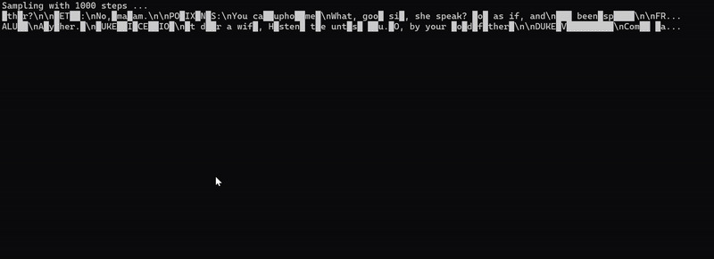

# Double Descent as a Lens for Sample Efficiency in Autoregressive vs. Discrete Diffusion Models


*Inference of masked discrete diffusion model on Shakespeare data*

## Abstract

Data scarcity drives the need for more sample-efficient large language models. In this work, we use the double descent phenomenon to holistically compare the sample efficiency of discrete diffusion and autoregressive models. We show that discrete diffusion models require larger capacity and more training epochs to escape their underparameterized regime and reach the interpolation threshold. In the strongly overparameterized regime, both models exhibit similar behavior, with neither exhibiting a pronounced second descent in test loss across a large range of model sizes. \edit{Overall, our results indicate that autoregressive models are more sample-efficient on small-scale datasets, while discrete diffusion models only become competitive when given sufficient capacity and compute.

## Repository Structure

The project is organized into three main directories:

```
├── discrete_diffusion_model/    # Discrete diffusion model implementation
├── nanoGPT/                    # Autoregressive model implementation  
├── tiny_shakespeare_dataset/   # Dataset preparation utilities
└── requirements.txt           # Project dependencies
```

## Installation

Install all required dependencies using pip:

```bash
pip install -r requirements.txt
```

## Directory Details

### 1. `discrete_diffusion_model/`

Implementation of a discrete diffusion model for text generation, heavily inspired and modified from the [nanoDD repository](https://github.com/flukeskywalker/nanoDD) to fit our experimental requirements.

**Training:**
```bash
python -u train.py d3pm_shakespeare --no-compile --data-dir ./data/shakespeare --embed-dim $n_embd
```

Where `$n_embd` is your chosen embedding dimension value.

- Runs for 50 epochs by default
- Saves model checkpoints automatically
- Additional hyperparameters can be modified in `configs.py`

**Sampling/Testing:**
```bash
python sample_d3pm.py \
    --ckpt_path=ckpt.pt \
    --dataset=shakespeare
```

### 2. `nanoGPT/`

Autoregressive transformer model implementation, heavily inspired and modified from [Karpathy's nanoGPT](https://github.com/karpathy/nanoGPT).

**Training:**
```bash
python -u train.py \
    --data_dir=shakespeare \
    --out_file=autoregressive_results.csv \
    --max_epoch_num=50 \
    --inf=False \
    --n_layer=12 \
    --n_head=12 \
    --n_embd=${n_embd} \
    --compile=False \
    --eval_iters=10 \
    --block_size=512 \
    --batch_size=12 \
    --device=cuda
```

**Sampling/Testing:**
```bash
python -u sample.py \
    --out_dir=sample_output \
    --init_from='resume' \
    --num_samples=5 \
    --max_new_tokens=100
```

### 3. `tiny_shakespeare_dataset/`

Contains dataset preparation utilities for the Shakespeare dataset.

**Data Preparation:**
```bash
cd tiny_shakespeare_dataset/
python prepare.py
```

This generates `train.bin` and `eval.bin` files required for both model training pipelines.

## Usage Workflow

1. **Prepare the dataset:**
   ```bash
   cd tiny_shakespeare_dataset/
   python prepare.py
   cd ..
   ```

2. **Train the discrete diffusion model:**
   ```bash
   cd discrete_diffusion_model/
   python -u train.py d3pm_shakespeare --no-compile --data-dir ./data/shakespeare --embed-dim 768
   ```

3. **Train the autoregressive model:**
   ```bash
   cd nanoGPT/
   python -u train.py \
       --data_dir=shakespeare \
       --out_file=autoregressive_results.csv \
       --max_epoch_num=50 \
       --inf=False \
       --n_layer=12 \
       --n_head=12 \
       --n_embd=768 \
       --compile=False \
       --eval_iters=10 \
       --block_size=512 \
       --batch_size=12 \
       --device=cuda
   ```

4. **Generate samples from trained models:**
   
   **Discrete Diffusion:**
   ```bash
   cd discrete_diffusion_model/
   python sample.py --ckpt_path=ckpt.pt --dataset=shakespeare
   ```
   
   **Autoregressive:**
   ```bash
   cd nanoGPT/
   python -u sample.py \
       --out_dir=sample_output \
       --init_from='resume' \
       --num_samples=5 \
       --max_new_tokens=100
   ```

## Configuration

- **Discrete Diffusion Model**: Modify hyperparameters in `discrete_diffusion_model/configs.py`
- **Autoregressive Model**: Hyperparameters can be adjusted via command-line arguments as shown above
- **Embedding Dimension**: Use the same `n_embd` value for both models to ensure fair comparison


## Acknowledgments

- Discrete diffusion implementation inspired by [nanoDD](https://github.com/flukeskywalker/nanoDD)
- Autoregressive implementation inspired by [nanoGPT] (https://github.com/karpathy/nanoGPT)repository contains implementations and experiments comparing sample efficiency of discrete diffusion models and autoregressive models on text generation tasks, specifically using the Shakespeare dataset.
